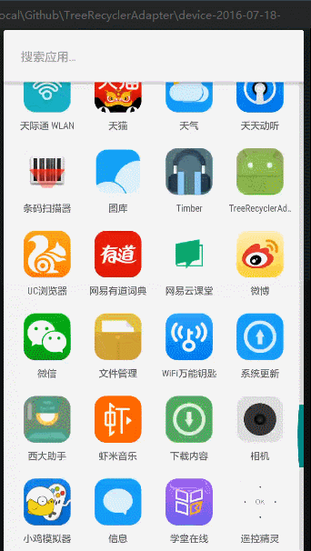

# README #

　　开发过程中总是会遇到实现树形结构的需求，使用ExpandableListView当然是可以实现的，而最近在想使用recyclerview会不会很麻烦呢，首先上github上搜了一下，很多采用了设定不同的viewholder和onBind来解决，同时还能实现很多级的展开。可能一开始很不容易理解，而且有些时候我们只需要两层结构。所以就花了点时间写了一个demo，以一个简单的方式来实现两层结构的TreeRecyclerView，不需要去实现一个自定义的recyclerview，也不需要对Adapter的结构有太大的改动。各位将就着看吧，很多地方是可以改进的。

# 实现思路 #

　　有时候我们遇到的json数据结构就是两层的，比如一个A中含有一些属性以及一个B的数组，这样我们在构建实体类的时候也会按照同样的结构来进行，所以我们先创建一个实体类ParentEntity代码如下

	public class ParentEntity {
	    private int id;
	    private String name;
	    private List<ChildEntity> children;

	    public static class ChildEntity{
	       private int id;
	       private String name;
	    }
	}
PS：构造函数省略了。。。 Parent和Child都只拥有id和name，但是其实这是两个不同的实体，因为如果绑定的数据是一个格式的，只是深度不一样的话，那就完全采用另外一种实现方法了，github上太多太多。

# 实现过程 #

## 第一步，adpter ##
　　如何实现数据的绑定就不多讲了，demo里面的item添加效果使用了开源项目[recyclerview-animators](https://github.com/wasabeef/recyclerview-animators)

　　主要是adapter的实现，首先我们定义一个adapter，实现其所需要的基础方法

	package com.jianyuyouhun.treerecycleradapter.adapter;

	import android.content.Context;
	import android.support.v7.widget.RecyclerView;
	import android.view.LayoutInflater;
	import android.view.View;
	import android.view.ViewGroup;
	import android.widget.TextView;
	
	import com.jianyuyouhun.treerecycleradapter.entity.ParentEntity;
	
	import java.util.List;
	
	/**
	 * Created by 剑雨丶游魂 on 2016/7/18.
	 */
	public class TreeAdapter extends RecyclerView.Adapter<TreeAdapter.MyViewHolder>{
	    Context context;
	    List list;
	    Integer layout;
	    int[] to;
	
	    public TreeAdapter (Context context, List<Object> list, Integer layout, int[] to){
	        this.context = context;
	        this.list = list;
	        this.layout = layout;
	        this.to = to;
	    }
	
	    @Override
	    public TreeAdapter.MyViewHolder onCreateViewHolder(ViewGroup parent, int viewType) {
	        MyViewHolder holder = new MyViewHolder(LayoutInflater
	                .from(context).inflate(layout, null));
	        return holder;
	    }
	
	    @Override
	    public void onBindViewHolder(final TreeAdapter.MyViewHolder holder, int position) {
			if (list.get(position) instanceof ParentEntity){//判断当前实体是否是Parent的实例
		        holder.child_name.setVisibility(View.GONE);
		        holder.parent_name.setVisibility(View.VISIBLE);
		        ParentEntity parent = (ParentEntity) list.get(position);
		        holder.parent_name.setText(parent.getName());
		    }else {//判断当前实体是否是Child的实例
		        holder.parent_name.setVisibility(View.GONE);
		        holder.child_name.setVisibility(View.VISIBLE);
		        ParentEntity.ChildEntity child = (ParentEntity.ChildEntity) list.get(position);
		        holder.child_name.setText(child.getName());
		    }
	    }
	
	    @Override
	    public int getItemCount() {
	        return list.size();
	    }
	
	    public class MyViewHolder extends RecyclerView.ViewHolder{
	        private TextView parent_name;
	        private TextView child_name;
	        public MyViewHolder(View itemView) {
	            super(itemView);
	            parent_name = (TextView) itemView.findViewById(to[0]);
	            child_name = (TextView) itemView.findViewById(to[1]);
	        }
	    }
	}

　　layout和to是R文件绑定用到的，可以不用写，直接在onCreateViewHolder和MyViewHolder中写上就行了，我个人是习惯把这些都放到activity中去声明然后传进来。

　　我们知道java是可以在运行时候再去获取加载类的类型的，所以我们定义的list是一个不指定数据类型的list，然后在onBindViewHolder中去获取当前位置的实体的类型，是Parent还是Child,然后做出具体的数据绑定操作，这里我的layout采用了framelayout来实现，可以更改为两个layout，不过项目越大，你的layout文件夹下面一大堆文件看上去也是挺累的呢，所以能省就省吧。
## 第二步 item点击事件和增加删除方法 ##

　　我们知道，recyclerview只负责视图绑定，事件与它无关，我们需要自己实现点击事件。然后就是点击展开时候把子数据动态添加进去，点击折叠时把子数据动态删除。需要两个方法。

　　首先是点击事件，先声明对外的接口。

	public interface OnItemClickListener {
        void onItemClick(View view, int position);
    }

    private OnItemClickListener onItemClickListener;

    public void setOnItemClickLitener(OnItemClickListener itemClickListener) {
        this.onItemClickListener = itemClickListener;
    }

　　然后在onBindViewHolder中添加

	if (onItemClickListener != null) {
	    holder.itemView.setOnClickListener(new View.OnClickListener() {
	        @Override
	        public void onClick(View v) {
	            int pos = holder.getLayoutPosition();
	            onItemClickListener.onItemClick(holder.itemView, pos);
	        }
	    });
	}
	
　　当然增加和删除不可少

	/**
     * 添加所有child
     * @param lists
     * @param position
     */
    public void addAllChild(List<?> lists, int position) {
        list.addAll(position, lists);
        notifyItemRangeInserted(position, lists.size());
    }

    /**
     * 删除所有child
     * @param position
     * @param itemnum
     */
    public void deleteAllChild(int position, int itemnum) {
        for (int i = 0; i < itemnum; i++) {
            list.remove(position);
        }
        notifyItemRangeRemoved(position, itemnum);
    }

### 第三步 点击事件 ###

　　我们要先知道我们点击的是父还是子，这里同样对实体的类型进行判断。实现如下

	adapter.setOnItemClickLitener(new TreeAdapter.OnItemClickListener() {
            @Override
            public void onItemClick(View view, int position) {
				if (list.get(position) instanceof ParentEntity){//判断是否为父
                    ParentEntity parent = (ParentEntity) list.get(position);
                    if ((position + 1) == list.size()) {//判断是否为最后一个元素
                        adapter.addAllChild(parent.getChildren(), position + 1);
                    } else {
                        if (list.get(position + 1) instanceof ParentEntity) {//如果是父则表示为折叠状态需要添加儿子
                            adapter.addAllChild(parent.getChildren(), position + 1);
                        } else if (list.get(position + 1) instanceof ParentEntity.ChildEntity) {//如果是儿子则表示为展开状态需要删除儿子
                            adapter.deleteAllChild(position + 1, parent.getChildren().size());
                        }
                    }
                }else {//是儿子你想干啥就干啥吧
                    ParentEntity.ChildEntity child = (ParentEntity.ChildEntity) list.get(position);
                    Toast.makeText(getApplicationContext(), child.getName(), Toast.LENGTH_SHORT).show();
                }
            }
        });

# 最后看下效果 #

　　还可以吧，有很多需要改进的地方，以后再实现一个可以复用的adpter给大家吧。

　　有兴趣去看下我的[个人部落](https://jianyuyouhun.com)吧

